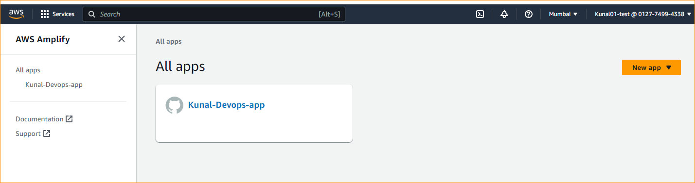
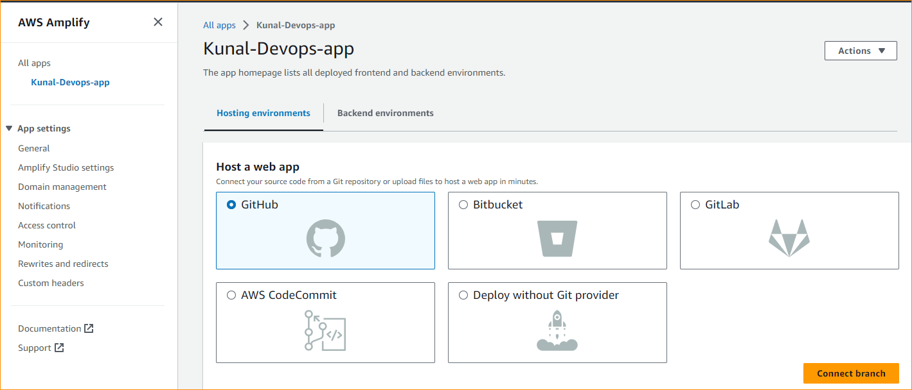
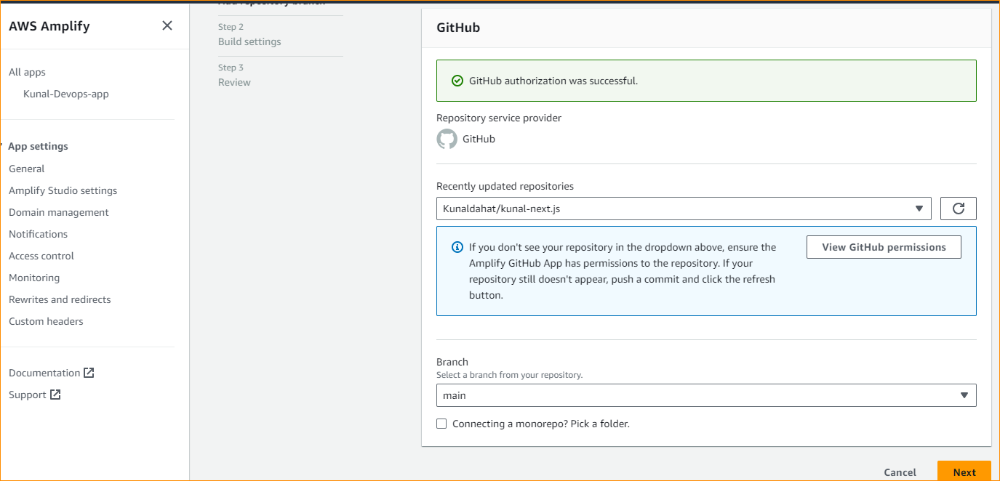

Assignment 

Outline
1. Search any publicly available Next.js sample application. This can be any static site build
with Next.js. Backend is not really required.
2. Clone this application code from step 1 in your GitHub repository.
3. Deploy this application on AWS Amplify.
a. Provision Amplify infrastructure using terraform.
b. Setup CI/CD pipeline with Amplify’s inbuilt functionality.
4. Create a detailed README file of the steps you followed for this setup.
5. Submit the deployed application url and a link to your repository with a README file in it
to HR Team.
NOTE - You can submit whatever progress you have made at the end of 3 days from the date of
receiving this assignment. Completing the assignment increases your chances of getting hired.
*****************************************************************************************************

LINK to deployed APP - https://main.d3mxvno3komwqt.amplifyapp.com/

Hands-On:
1. Clone
   
I found a sample next.js code on Google and cloned it in the local system. Created a new repository on GitHub and pushed the code from local to the new repository \
git clone <repo> \
git add . \
git commit -m "myapp" \
git push \

\
\
2. Creating Amplify infra using TERRFORM :
(To understand it better firstly I manually deployed the APP once and then went for the terraform)

Download and install Terraform in local system \
Download and install AWS CLI in local system \
Configure loacal system with AWS with command "aws configure" then by adding Secret ID and secret key. 

Wrote a config file - main.tf  \
The Configuration file is required because it tells terraform what resources to create on cloud platfoorm.
>>

<<
Command: \
terraform init \
terraform fmt \
terrafrom validate \
terraform apply 

  
#Here the deployed app by name - Kunal-Devops-app in console via terraform.

3. Setting CI/CD pipeline on Amplify to automated deployent on every push on github repository.

Amplify suppoert builtin CICD pipeline and give many option, I selevted GitHub

The the GitHub branch.

Finally Clicked on Save & Deploy.

Now, every time I push changes to the selected branch on your GitHub repository, Amplify will automatically trigger the CICD pipeline to deploy my app on AWS Amplify.

Sucessfully completed the Assignment. It was very Intresting and challenging.
My research skill helped me to achive this.

Thanks.
*************************************************************************************************
LINK to deployed APP - https://main.d3mxvno3komwqt.amplifyapp.com/
